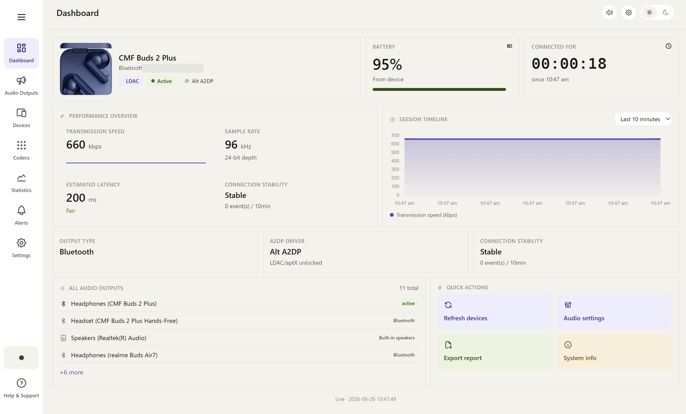

# Codec Monitor

Real-time Bluetooth audio codec monitor for Windows. See exactly which codec (SBC, AAC, aptX, aptX HD, LDAC), bitrate, sample rate, and bit depth your Bluetooth headphones are actually using — read directly from the system, not guessed.




## Features

- **Real codec detection** — reads the actual negotiated codec from the Alternative A2DP Driver registry (no hardcoded values)
- **Live dashboard** — bitrate, sample rate, bit depth, battery, connection uptime, all updating in real time
- **Session timeline** — interactive Chart.js graph of bitrate over time with configurable ranges
- **Connection stability** — tracks disconnects and codec downgrades (Windows has no RSSI API for connected classic BT devices, so this is an honest proxy)
- **Device management** — shows all known Bluetooth devices with live connection status via direct Win32 API calls (sub-millisecond, no PowerShell)
- **Codec comparison** — educational breakdown of SBC, AAC, aptX, aptX HD, and LDAC with interactive bars
- **Smart alerts** — debounced notifications for codec upgrades/downgrades, connects/disconnects
- **Export reports** — CSV, Markdown, and PDF export of session history
- **System tray** — minimizes to tray, keeps monitoring in the background
- **Light & dark themes** — toggle between light and dark mode
- **Auto device photos** — automatically fetches product images for connected devices

## Requirements

- **Windows 10 or 11**
- **Python 3.10+** (for running from source)
- **[Alternative A2DP Driver](https://bluetoothgoodies.com/a2dp/)** (optional but recommended — unlocks LDAC/aptX HD codecs; without it, Windows only supports SBC)

## Quick Start

### Option 0: Download a Prebuilt Release

Grab the latest standalone exe or installer from the [Releases page](https://github.com/Iam-Master/Codec-Monitor/releases) — no Python required.

### Option 1: Run from Source

1. Clone this repository:
   ```bash
   git clone https://github.com/Iam-Master/Codec-Monitor.git
   cd Codec-Monitor
   ```

2. Double-click `start.bat` — it will:
   - Create a Python virtual environment (first run only)
   - Install dependencies
   - Launch the app

### Option 2: Build Standalone Exe

1. Run `start.bat` first (sets up the venv)
2. Double-click `build.bat` — it will:
   - Build a single-file exe via PyInstaller
   - Optionally build a Windows installer via Inno Setup (if installed)
   - Output to `dist/`

## Project Structure

```
codec-monitor/
├── backend/
│   ├── app.py              # Desktop app shell (pywebview + pystray)
│   ├── monitor.py          # Core backend: codec detection, polling, HTTP/WS servers
│   ├── codec_info.json     # Educational content for the Codecs page
│   ├── icon.ico            # App/window/tray icon (also bundled by PyInstaller)
│   ├── icon.png            # Tray icon image, loaded at runtime by app.py
│   ├── codec_monitor.spec  # PyInstaller build spec
│   ├── requirements.txt    # Python dependencies
│   └── requirements-dev.txt
├── frontend/
│   ├── index.html          # Single-page app UI
│   ├── app.js              # Frontend logic, WebSocket client, Chart.js
│   └── style.css           # Full design system with light/dark themes
├── screenshots/            # README images
├── .github/                # Issue/PR templates, CI and release workflows
├── start.bat               # One-click launcher
├── build.bat               # Build standalone exe + installer
├── installer.iss           # Inno Setup installer script
├── LICENSE
├── CONTRIBUTING.md
└── CHANGELOG.md
```

## How It Works

### Architecture

```
┌─────────────────────────────────────────────────────────┐
│  pywebview Window (app.py)                              │
│  ┌───────────────────────────────────────────────────┐  │
│  │  Frontend (HTML/JS/CSS)                           │  │
│  │  ← WebSocket (port 8766) ← live snapshots         │  │
│  │  ← HTTP (port 8765) ← static files + REST API    │  │
│  └───────────────────────────────────────────────────┘  │
├─────────────────────────────────────────────────────────┤
│  Backend (monitor.py)                                   │
│  ┌──────────┐ ┌──────────┐ ┌────────────────────────┐  │
│  │ Fast Loop│ │ Slow Loop│ │ Endpoints Loop         │  │
│  │ (800ms)  │ │ (3s+)   │ │ (1.5s)                 │  │
│  │ Registry │ │ PS+Batt │ │ AudioEndpoint          │  │
│  │ + pycaw  │ │ via PS  │ │ via PS                 │  │
│  └──────────┘ └──────────┘ └────────────────────────┘  │
│  ┌──────────────────────────────────────────────────┐   │
│  │ Win32 CfgMgr32 API — instant device connection   │   │
│  │ status (no PowerShell)                            │   │
│  └──────────────────────────────────────────────────┘   │
└─────────────────────────────────────────────────────────┘
```

- **Fast loop** (~800ms): Reads codec/bitrate/sample-rate directly from the Alt A2DP Driver registry + checks the Windows default playback device via pycaw. This is what makes codec changes and device switches show up in under a second.
- **Slow loop** (~3s+): PowerShell-based battery lookups via `Get-PnpDeviceProperty` (~1.2s per device). Results are cached and read by the fast loop.
- **Endpoints loop** (~1.5s): Enumerates all audio endpoints (speakers, HDMI, USB) independently of the slow BT loop.
- **Win32 direct calls**: Device connection status uses `CfgMgr32` via ctypes — instant, no subprocess overhead.

> **A note on the timings.** The intervals shown in the diagram — `(800ms)`, `(3s+)`, `(1.5s)` — are the **sleep intervals *between* polling cycles**, not the duration of a full cycle. The slow loop in particular can take much longer per cycle — roughly **2–60s** — because it issues PowerShell battery queries (`Get-PnpDeviceProperty`, measured at ~1.2s per device). The fast loop is what keeps the UI responsive regardless of how long the slow loop takes on a given pass.

For the full HTTP and WebSocket API (endpoints, message types, and payload shapes), see [docs/API.md](docs/API.md).

## Configuration

Settings are stored in `%APPDATA%\CodecMonitor\settings.json` (packaged exe) or `backend/settings.json` (source). Configurable options:

| Setting | Default | Description |
|---|---|---|
| `poll_interval_ms` | 800 | How often the fast loop polls (milliseconds) |
| `history_retention_days` | 14 | How long to keep history in the database |
| `notifications_enabled` | true | Show Windows toast notifications for events |
| `start_minimized` | false | Launch with the window hidden to the system tray — the app starts in the background with no window shown on screen (open it from the tray icon) |
| `close_action` | "minimize" | What happens when you close the window: `"minimize"` (to tray) or `"quit"` |
| `tracked_devices` | [] | Only monitor these device names (empty = all) |

## Device Photos

Codec Monitor automatically fetches product images for connected Bluetooth devices using DuckDuckGo image search. Photos are cached in `device_photos/` and reused on subsequent launches.

You can also manually place images in `device_photos/` — name them `<slugified-device-name>.<png|jpg|webp>` (e.g., `sony_wh_1000xm4.png`).

## Troubleshooting

**Codec shows as unknown / SBC only / not detected**

- Codec Monitor reads the *real* negotiated codec from the Alternative A2DP Driver's registry keys. Without that driver, Windows only implements **SBC** for Bluetooth audio, so SBC is all you'll ever see (the app falls back to SBC at 328 kbps for a connected BT device when it can't read anything richer). Check the dashboard's Alt A2DP indicator, or `alt_a2dp_installed` in `GET /sysinfo`.
- The codec is read for the device Windows is *actually* playing to (its default playback device, detected via pycaw). If audio is routed elsewhere — or nothing is playing — the active device may not resolve. Start playback and make the headphones your default playback device.
- When no active output device is detected at all, the snapshot reports `PCM` (the system fallback), not a Bluetooth codec.
- After connecting, give the fast loop a moment to catch up, or click **Refresh** to force an immediate re-poll.

**A Bluetooth device doesn't appear in the Devices list**

- The list is built from devices Windows reports as paired, devices previously seen in history, and the currently active device. The device must be **paired** in *Windows Settings → Bluetooth & devices* first.
- If `tracked_devices` in your settings is a non-empty list, only those exact device names are monitored and shown. Set it back to `[]` to track all paired devices.
- Live connection status comes from a direct Win32 (`CfgMgr32`) lookup, so a device that is paired but powered off or out of range shows as *not connected*. Power it on / reconnect it.

**The dashboard shows 'disconnected' / the WebSocket won't connect**

- The UI receives live data over a WebSocket at `ws://127.0.0.1:8766`. If the indicator stays disconnected, that socket isn't reachable — most often because another program is using port **8766** (or the HTTP port **8765**), or a previous instance didn't shut down cleanly. Close any stray instances and restart.
- The WebSocket only accepts connections from a `127.0.0.1` / `localhost` origin. Open the dashboard through the app window (or `http://127.0.0.1:8765/`), not via some other hostname.
- A firewall or endpoint-security tool that blocks local loopback connections can also break it.

**Device photos aren't loading**

- Photos are fetched automatically via a DuckDuckGo image search, which needs **internet access**. With no connection — or if the lookup fails or returns nothing — the device simply shows without a photo. This is expected and harmless.
- Successful lookups are cached in `backend/device_photos/` and reused on later launches. You can also add a photo **manually**: drop an image into that folder named `<slugified-device-name>.<png|jpg|webp>` (e.g. `sony_wh_1000xm4.png`). It will be served on the next refresh.

**The app won't start / an instance is already running**

- Codec Monitor is single-instance. On launch it probes a control port (**8767**); if another copy is already running, the new launch just tells the existing one to show its window and then exits. So if "nothing happens" when you start it, it's usually already running — look for the **icon in the system tray** and click it (or use the tray menu's *Open Dashboard*).
- If a previous run crashed and left a process behind, the ports (8765 / 8766 / 8767) can stay occupied. End the stray *Codec Monitor* / Python process in Task Manager, then relaunch.

**Battery percentage isn't shown for some devices**

- Battery level comes from Windows' own PnP battery property (`Get-PnpDeviceProperty`), gathered by the slow loop. That loop is deliberately slow — each query takes ~1.2s and a full cycle can run anywhere from 2–60s — so battery may take a few seconds to appear after a device connects.
- Not every device reports a battery level to Windows. If a device never exposes one, the field stays blank — that's a Windows/device limitation, not a Codec Monitor bug. When a value is available, the app shows the last known reading.

## Contributing

See [CONTRIBUTING.md](CONTRIBUTING.md) for guidelines.

## License

This project is licensed under the MIT License — see [LICENSE](LICENSE) for details.
